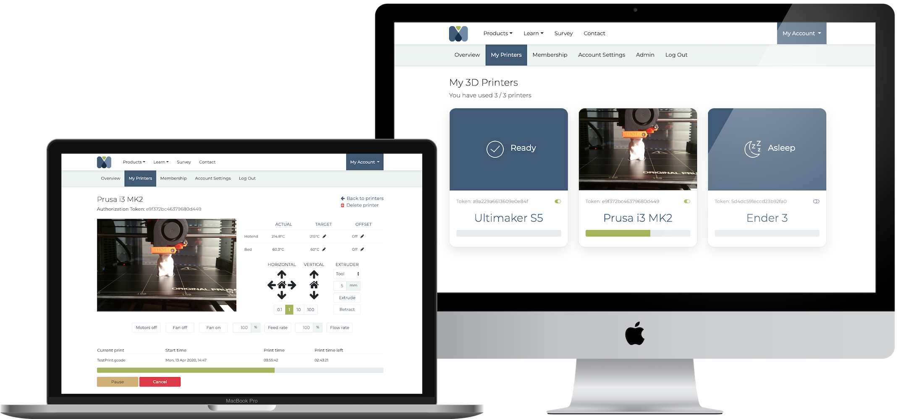

# OctoPrint-Mattacloud

<p align="center">
    
    <br/>
    <i>Add complete remote control and monitoring and A.I. error detection to your 3D printer.</i>
    <br/>
</p>

Automatic and intelligent error detection and process monitoring for your OctoPrint-enabled 3D printer, with full remote control, management and access from anywhere. Additionally, receive notifications and updates via your chosen communication medium, alerting you of failures and keeping you updated on the state of the 3D print. Overview your print history and gain insights into filament use, print times and your printer reliability.

Learn more about **Mattacloud** and its features - [https://mattalabs.com/products/mattacloud/](https://mattalabs.com/products/mattacloud/)

## Plugin Installation

The easiest way to get OctoPrint-Mattacloud is to download the Raspbian based SD card image for the Raspberry Pi which contains OctoPrint along with everything required for Mattacloud to run smoothly. The image also uses Python 3, so if you need to upgrade from Python 2 why not check it out!

Due to Python 2's EOL status, OctoPrint-Mattacloud requires you to be running **Python 3**. If you are still running OctoPrint with Python 2 you should probably upgrade anyway. Here is a blog post outlining the upgrading process [https://octoprint.org/blog/2020/09/10/upgrade-to-py3/](https://octoprint.org/blog/2020/09/10/upgrade-to-py3/).

OctoPrint-Mattacloud uses WebRTC to enable real-time video streams from the printer to your device. In order to utilise this capability a few additional packages need to be installed on your Raspberry Pi (or other device) running OctoPrint.

If you are not using the Mattacloud SD image then you need to install the following packages:

```
sudo apt install libavformat-dev libavcodec-dev libavdevice-dev libavutil-dev libavfilter-dev libswscale-dev libswresample-dev python-dev python3-dev libsrtp2-dev libsrtp2-1 libopus-dev libvpx-dev pkg-config
```

Currently, the OctoPrint-Mattacloud plugin has not been uploaded to OctoPrint plugin repository, and as such requires manual installation from this GitHub repo.

Activate your Python 3 virtualenv where OctoPrint is installed. It will be something like ```source oprint/bin/activate```. Then install the plugin.

```
pip install git+https://github.com/Mattalabs/OctoPrint-Mattacloud
```

When the plugin has installed, restart OctoPrint and begin the Printer Setup process outlined below.

## Printer Setup

The setup progress takes less than 5 minutes and consists of 5 simple steps. If you follow these, all the benefits of **Mattacloud** will apply to your printer. Happy printing!

1. [Sign up](https://cloud.mattalabs.com/accounts/signup/) to the **Mattacloud** free beta trial. If you already have, just [login](https://cloud.mattalabs.com/accounts/login/). (Trial lasts for the duration of beta testing.)
2. Select your membership type - at this stage you can only choose the free beta membership.
3. Add a printer to your **Mattacloud** by following the setup guide.
4. After installing the OctoPrint-Mattacloud Plugin on your OctoPrint enabled device, copy the authorization token from your newly created printer on **Mattacloud** into the authorization token input box presented in the OctoPrint-Mattacloud plugin settings. You can see all of your printers and their respective tokens [here](https://cloud.mattalabs.com/printer-dashboard/).
5. Test your token using the **Activate** button adjacent to the input box.
6. You are all setup. Happy printing!

## Report problems

If something does not appear to be working correctly and you think you may have found a bug in the OctoPrint-Mattacloud Plugin, please create an issue on the official page [here](https://github.com/dougbrion/OctoPrint-Mattacloud/issues). In this way your issue can be understood and fixed quickly.

Or feel free to contact us via [whatsthematta@mattalabs.com](mailto:whatsthematta@mattalabs.com).

### Error detection and process monitoring

3D printers are not the most reliable of machines. All of us have suffered from errors whilst printing and many users find themselves _handcuffed_ to their printers, having to constantly check the printer every 5 minutes to make sure that the print is _still_ okay! If this sounds familiar to you... hopefully this plugin will help.

Numerous computer vision techniques are used to determine if an error has occurred during your 3D print. Using a mixture of machine learning, 3D printing heuristics and the direct comparison of g-code to the current state of the 3D print, an errors are reliably determined in an image of the print.

<p align="center">
    
    <br/>
    <i>Personal and industrial versions of Mattacloud come with state-of-the-art AI error detection.</i>
    <br/>
</p>

Errors that the personal and industrial plans are capable of detecting are:

- Detatchment from print bed
- Offset
- Warping
- Poor bed adhesion
- Spaghetti
- Blocked extruder / out of filament
- Hotend too close to print bed

At present, the Beta plan does not support error detection.

### Remote control and management

Access your 3D printer from anywhere in the world (provided that there is an internet connection...) via the OctoPrint-Mattacloud Plugin.

At present, the plugin enables you to do the following:

- View and update hotend, bed and chamber temperatures
- Control and home X, Y and Z axes
- Select prints to retrieve information
- Start, cancel, pause, resume and restart 3D prints
- Upload g-code files remotely to your printer for printing
- Delete g-code files remotely
- Receive the latest images/snapshots from your printer
- See your prints progress (time remaining and percentage completion)

### Notifications and updates

<p align="center">
    
    <br/>
    <i>Keep informed by receiving notifications and updates from the <b>Mattacloud</b> to your device.</i>
    <br/>
</p>

By installing this plugin and linking a printer to your **mattacloud** account, you can receive useful notifications and updates concerning your 3D printer via various channels. When an error occurs during the 3D printing process, you will receive an alert with an attached image showing the error in addition to current progress, material usage and other useful statistics; you can then deside to take action. Additionally, you can also set up other checkpoints to receive notifications, such as upon object completion, or when a print has reached the half way mark. 

The communication channels which are currently supported are:

- Email (in Beta plan)
- SMS (personal and industrial plans)
- WhatsApp (personal and industrial plans)
- Facebook Messenger (personal and industrial plans)

## License

View the [OctoPrint-Mattacloud plugin license](https://github.com/dougbrion/OctoPrint-Mattacloud/blob/master/LICENSE)
